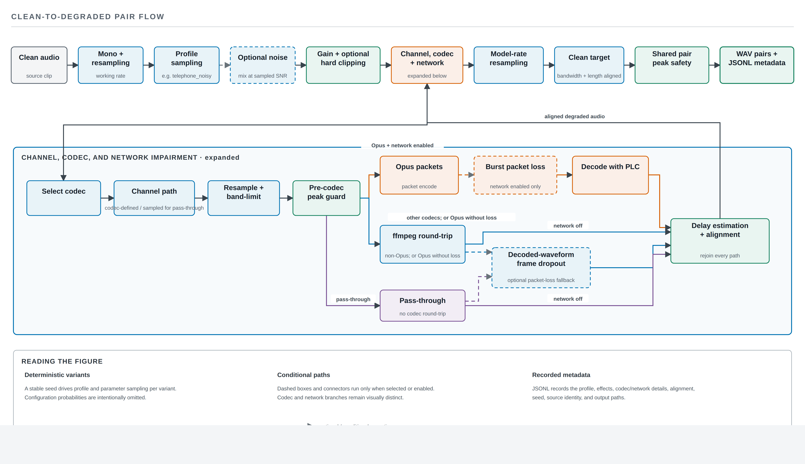
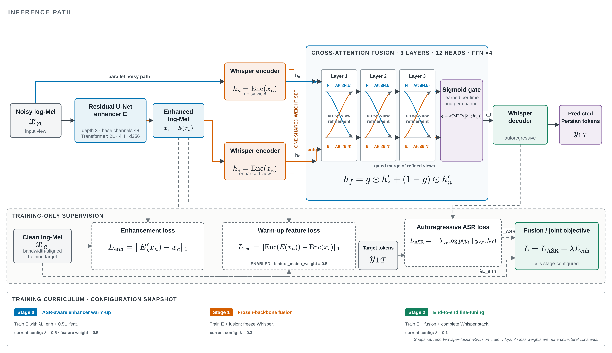

# Robust Speech Recognition in Persian Language

Slide-content specification for a 20-minute M.Sc. thesis defense.

## Deck-wide guidance

- **Language:** English. Keep established names and acronyms such as Whisper-small, VoIP, WER, CER, FFmpeg, PLC, log-Mel, and JSONL unchanged.
- **Format:** 16:9 widescreen. Use a clean academic theme with high contrast and one accent color for the proposed/selected method.
- **Narrative:** domain mismatch → reproducible telecom simulation → three compared systems → results → interpretation and limitations.
- **Visual rule:** keep one main claim per slide. Prefer charts, diagrams, and short labels over paragraphs.
- **Results colors:** ordinary Whisper = gray; multi-condition Whisper = blue; dual-stream fusion = orange. Use the same mapping on every chart.
- **Metric rule:** lower WER/CER is better. Always distinguish percentage points from relative percentages.
- **Caution rule:** boldface indicates the lowest observed value, not statistical significance.
- **Asset paths:** all paths below are relative to this Markdown file.

---

## Slide 1 — Robust Speech Recognition in Persian Language

**Purpose:** Introduce the thesis and establish the application domain.

**Visible content**

> **Robust Speech Recognition in Persian Language**  
> Adapting Whisper-small to Telephone and VoIP Degradations

- Pouya Fallah Sichani
- M.Sc. Thesis in Computer Engineering
- Supervisor: Dr. Hosein Sameti
- Sharif University of Technology · February 2026

**Visual / layout**

- Center the title and subtitle in the upper two-thirds.
- Place author, supervisor, institution, and date in a compact footer block.
- Optional subtle background motif: a clean waveform gradually becoming band-limited; do not imply experimental data.

**Speaker notes**

This thesis studies robust Persian automatic speech recognition under telephone and Voice over IP conditions. The central question is whether carefully simulated, traceable telecom degradations can reduce the mismatch between ordinary Persian speech data and real calls—and whether a more complex enhancement-and-fusion model improves further over a strong multi-condition baseline.

**Timing:** 25 seconds

**Thesis sources:** `front/info.tex`; `front/abstract-eng.tex`

---

## Slide 2 — The Deployment Mismatch

**Purpose:** Motivate why ordinary ASR training is insufficient for calls.

**Visible content**

### Models usually see

- Relatively clean, wideband speech
- Short, read utterances
- Public speech corpora

### Real calls may contain

- Environmental noise and gain variation
- Telephone bandwidth restriction
- Codec artifacts and packet loss
- Spontaneous, continuous speech

**Takeaway:** A Persian ASR model trained mainly on ordinary speech may lose substantial accuracy on real telephone and VoIP audio.

**Visual / layout**

- Two-column “training” versus “deployment” comparison.
- Between the columns, show a mismatch arrow labelled **domain shift**.
- Use simple icons only; do not add unreported quantitative claims.

**Speaker notes**

ASR accuracy depends not only on language and content, but also on how closely training conditions match deployment. This mismatch is especially important for Persian because public resources are more limited, while collecting and transcribing real calls is expensive and raises privacy and legal concerns. Controlled simulation is therefore attractive, but it must transfer to real—not only synthetic—channels.

**Timing:** 50 seconds

**Thesis sources:** `chapters/introduction.tex`, sections “Problem Definition” and “Importance and Scope”

---

## Slide 3 — Research Questions

**Purpose:** State the decisions the experiments were designed to support.

**Visible content**

1. Does adding synthetically degraded speech reduce Whisper-small error relative to ordinary fine-tuning?
2. Does this benefit transfer to real telephone and VoIP speech without a broad loss on general Persian speech?
3. Does fusing original and enhanced representations beat both ordinary and multi-condition Whisper?
4. Does the learned gate actually use both streams?

**Visual / layout**

- Present the questions as four numbered cards.
- Group Questions 1–2 under **Data strategy** and Questions 3–4 under **Model strategy**.

**Speaker notes**

The evaluation was deliberately designed to permit a negative answer for the proposed fusion architecture. The relevant comparison is not merely against ordinary Whisper, but against a simpler model exposed to the same degradation knowledge through multi-condition training.

**Timing:** 45 seconds

**Thesis sources:** `chapters/introduction.tex`, section “Research Questions”

---

## Slide 4 — Proposed Approach at a Glance

**Purpose:** Give the audience a map of the work before technical detail.

**Visible content**

1. **Unify Persian corpora**  
   Common TSV contract, 16 kHz mono audio, shared text normalization
2. **Generate traceable degradations**  
   Aligned clean–degraded pairs with deterministic seeds and metadata
3. **Train three systems**  
   Ordinary Whisper · Multi-condition Whisper · Dual-stream fusion
4. **Evaluate synthetic-to-real transfer**  
   Five held-out test sets, including real AGFarsdat calls

**Visual / layout**

- Horizontal four-stage pipeline with one icon per stage.
- Highlight Stage 2 as the data contribution and Stage 3 as the model comparison.

**Speaker notes**

The method operates at three levels: consistent data preparation, reproducible telecom simulation, and model training. The main experimental logic is to first isolate the effect of degraded training data in a controlled single-stream comparison, then test whether a dual-stream enhancement pathway provides additional useful information.

**Timing:** 45 seconds

**Thesis sources:** `chapters/work.tex`, opening and “Solution Overview”

---

## Slide 5 — Data: Training Diversity and Held-Out Evaluation

**Purpose:** Show the data roles and why AGFarsdat is central.

**Visible content**

### Training and validation

| Dataset | Train | Validation | Role |
|---|---:|---:|---|
| Common Voice Persian 25 | 299,430 | 10,006 | General speech + degradation source |
| FarsSpon (restricted) | 600,672 | 6,044 | Spontaneous Persian speech |
| FLEURS Persian | 3,019 | 362 | Read speech + domain diversity |

### Held-out test sets

| Test set | Evaluated samples | Main characteristic |
|---|---:|---|
| **AGFarsdat normalized** | **10,044** | **Real telephone and VoIP** |
| Common Voice Persian 25 | ≈10,518 | Crowdsourced general speech |
| FLEURS Persian | 871 | Multi-domain read speech |
| PersianSpeech | 24 | Small public Persian test set |
| Persian Speech Corpus | 391–396 | Out-of-domain Persian speech |

**Visual / layout**

- Use two compact table panels; emphasize the AGFarsdat row with the accent color.
- Add a small “not generated by our simulator” badge beside AGFarsdat.

**Speaker notes**

All datasets follow the same TSV contract and audio/text preprocessing. Longer variants were also produced by concatenating two to four clips into 5–20 second examples. AGFarsdat is the most important application-domain test because it contains real telephone and VoIP speech and was not used to generate synthetic training samples. Test counts can vary slightly when references exceed Whisper’s token limit.

**Timing:** 65 seconds

**Thesis sources:** `chapters/work.tex`, tables “Main training and validation datasets” and “Held-out test sets”

---

## Slide 6 — Reproducible Paired-Data Generation

**Purpose:** Explain what makes the augmentation traceable and suitable for enhancement training.

**Visible content**

### For every clean utterance

- Generate **two independent degraded variants**
- Derive the seed deterministically from the tuple: `(1337, split, source ID, variant ID)`
- Align clean and degraded waveforms in time and length
- Build a clean target with the **same channel bandwidth**

### Save more than audio

- New split TSV files
- `degraded_to_clean.jsonl`
- `degradation_metadata.jsonl`
- Profile, noise, SNR, gain, codec, bitrate, delay, packet loss, and normalization metadata

**Takeaway:** Every sample can be reproduced, audited, and grouped by degradation condition.

**Visual / layout**

- Left: one clean clip branching to two degraded variants.
- Right: a metadata record icon pointing back to source and parameters.

**Speaker notes**

Randomness is controlled per sample, so changing processing order does not change a clip’s degradation. Codec delay is estimated and compensated, and pair lengths are aligned. For narrowband paths, the clean enhancement target is also band-limited; the enhancer is therefore not penalized for failing to reconstruct frequencies fundamentally removed by the channel.

**Timing:** 60 seconds

**Thesis sources:** `chapters/work.tex`, subsection “Reproducibility and Outputs” and subsection “Channel, Codec, and Network Chain”

---

## Slide 7 — Telecom Degradation Pipeline

**Purpose:** Present the complete simulation pipeline using the thesis diagram.

**Visible content**



**Callout labels to add in PowerPoint**

- Four interpretable profiles: clean telephone, noisy telephone, lossy VoIP, mobile wideband
- DEMAND noise; SNR sampled from −5 to 15 dB; gain from −6 to +6 dB
- Narrowband or wideband channel filtering
- Real FFmpeg codec round-trips
- Burst packet loss; packet-level Opus loss with decoder PLC
- Delay compensation, length alignment, and shared pair normalization

**Visual / layout**

- Use the diagram nearly full-slide, preserving aspect ratio.
- Reveal or discuss it left to right; avoid shrinking it to make room for paragraph text.
- Add no more than three small callouts at once if animation is available.

**Speaker notes**

The order is intentional: noise and gain occur before channel and codec processing, while network impairment occurs after encoding. Supported codecs include G.711 A-law and μ-law, GSM, AMR-NB, AMR-WB, and narrowband or wideband Opus. Opus packets can be removed before decoding so the decoder’s own packet-loss concealment is exercised. For non-Opus codecs, decoded-waveform frame dropout is explicitly recorded as an approximation rather than exact network simulation.

**Timing:** 85 seconds

**Thesis sources:** `chapters/work.tex`, “Degradation Profiles” and “Channel, Codec, and Network Chain”; thesis Figure “Architecture of the clean–degraded pair generation pipeline”

---

## Slide 8 — Three Systems, One Key Controlled Comparison

**Purpose:** Define the model variants and the experimental logic.

**Visible content**

| System | Training input | Added architecture | Main question |
|---|---|---|---|
| **Ordinary Whisper** | Ordinary Persian + long variants | None | Language adaptation baseline |
| **Multi-condition Whisper** | Ordinary + long + degraded variants | None | Effect of degraded training data |
| **Dual-stream fusion** | Original and enhanced views | Enhancer + cross-attention + gate | Added value beyond multi-condition training |

**Controlled evidence:** The two single-stream Whisper runs use the same seed, optimizer settings, evaluation data, and decoding setup; their key difference is data composition.

**Visual / layout**

- Use the table as the main visual.
- Draw a bracket around the first two rows labelled **controlled data comparison**.

**Speaker notes**

Whisper-small was chosen to balance model capacity against the cost of multiple training runs. The ordinary and multi-condition systems are the cleanest causal comparison in the thesis. The fusion model changes both architecture and training schedule, so its comparison is informative but not as tightly controlled.

**Timing:** 55 seconds

**Thesis sources:** `chapters/work.tex`, sections “Fine-tuning Whisper-small” and “Dual-stream Fusion Model for Whisper”; `chapters/results.tex`, “Evaluation Protocol”

---

## Slide 9 — Dual-Stream Enhancement and Fusion

**Purpose:** Explain the proposed architecture and its intended advantage.

**Visible content**



**Callout labels to add in PowerPoint**

- Degraded input → original log-Mel view + enhanced log-Mel view
- Residual U-Net enhancer with temporal bottleneck modeling
- Shared Whisper encoder for both views
- Bidirectional cross-attention exchanges information
- Time–feature gate selects a soft mixture for decoding

**Visual / layout**

- Use the diagram full-width and preserve aspect ratio.
- Highlight the two parallel streams first, then the fusion/gate block.

**Speaker notes**

Enhancement can remove noise but may also remove low-energy phonetic cues or introduce artifacts. The architecture therefore keeps the original representation rather than replacing it. Both views pass through a shared encoder, exchange information using bidirectional cross-attention, and are combined by a learned gate that can, in principle, select the more useful view at each time–feature location.

**Timing:** 80 seconds

**Thesis sources:** `chapters/work.tex`, section “Dual-stream Fusion Model for Whisper”; thesis Figure “Dual-stream fusion architecture and three-stage training schedule”

---

## Slide 10 — Three-Stage Training Strategy

**Purpose:** Show how the more complex model was optimized.

**Visible content**

1. **Enhancer warm-up — up to 20k steps**  
   Prepare the enhancer using reconstruction and encoder-feature guidance
2. **Fusion training with Whisper frozen — up to 30k steps**  
   Train enhancer and fusion components without destabilizing the recognizer
3. **End-to-end joint training — up to 120k steps**  
   Optimize the complete ASR system jointly

**Final run improvements over the first fusion run**

- Initialize from multi-condition Persian Whisper
- Add a two-layer transformer at the enhancer bottleneck
- Add encoder-feature matching during warm-up
- Increase joint-training ceiling from 50k to 120k steps

**Visual / layout**

- Horizontal three-stage timeline with lock/unlock icons for Whisper.
- Put the final-run changes in a small right-side panel.

**Speaker notes**

The final fusion model was not simply a longer copy of the first run: several factors changed simultaneously. Consequently, the improvement between fusion versions cannot be attributed to one component. This distinction matters later when interpreting the development result.

**Timing:** 55 seconds

**Thesis sources:** `chapters/work.tex`, subsection “Three-stage Training Schedule”; `chapters/results.tex`, “Fusion-model Development Trend”

---

## Slide 11 — Evaluation Protocol

**Purpose:** Define the metrics and comparison caveats before showing results.

**Visible content**

### Error rate

\[
\mathrm{ER}=\frac{S+D+I}{N}
\]

- **WER:** substitutions, deletions, and insertions over reference words
- **CER:** the same operations over reference characters
- Lower is better; the two metrics expose different error patterns

### Shared evaluation setup

- Greedy decoding and identical Persian text normalization
- Five test sets covering general and real telecom speech
- Single-stream models: **21,848 identical samples**
- Fusion model: **21,854 samples**—six more, or 0.027% of the total

**Visual / layout**

- Formula and metric definitions on the left; protocol facts on the right.
- Add a caution icon beside the six-sample mismatch.

**Speaker notes**

The two single-stream runs are fully paired. The fusion aggregate is not perfectly paired because it includes one additional Common Voice and five additional Persian Speech Corpus examples. This is a very small fraction, but it reinforces why small differences involving fusion must not be presented as conclusive. No confidence intervals or significance tests were computed.

**Timing:** 60 seconds

**Thesis sources:** `chapters/results.tex`, section “Evaluation Protocol”

---

## Slide 12 — Main Result: Multi-Condition Training Wins Overall

**Purpose:** Deliver the principal quantitative finding.

**Visible content**

### Aggregate error across all test sets

| System | WER | CER | WER change vs. ordinary |
|---|---:|---:|---:|
| Ordinary Whisper | 23.27% | 10.84% | — |
| **Multi-condition Whisper** | **17.83%** | **7.93%** | **−5.44 pp** |
| Dual-stream fusion | 18.44% | 14.04% | −4.82 pp |

**Key result:** Multi-condition training reduces WER by **23.4% relative** and CER by **26.8% relative** compared with ordinary Whisper.

**Visual / layout**

- Preferred visual: two grouped bar charts, WER and CER, sharing the system color mapping.
- Put the 23.4% relative WER reduction in a large callout above the WER chart.
- Keep the exact values visible as data labels.

**Editable chart data**

```csv
system,WER,CER
Ordinary Whisper,23.27,10.84
Multi-condition Whisper,17.83,7.93
Dual-stream fusion,18.44,14.04
```

**Speaker notes**

This is the strongest result of the thesis. Adding degraded speech lowers aggregate WER from 23.27% to 17.83%—5.44 percentage points, or 23.4% relative. Because the single-stream runs use the same evaluation and optimization settings, this provides controlled evidence for multi-condition training. Fusion remains better than ordinary Whisper but is 0.62 percentage points worse than the multi-condition baseline and has substantially worse CER.

**Timing:** 80 seconds

**Thesis sources:** `chapters/results.tex`, table “Aggregate results of the three main methods” and section “Aggregate Results”

---

## Slide 13 — Synthetic Degradations Transfer to Real Calls

**Purpose:** Show that the data strategy improves the target domain, not only synthetic or general speech.

**Visible content**

### AGFarsdat: real telephone and VoIP speech

| System | WER | Absolute change vs. ordinary |
|---|---:|---:|
| Ordinary Whisper | 35.63% | — |
| Multi-condition Whisper | 25.80% | −9.83 pp |
| Dual-stream fusion | **25.38%** | −10.25 pp |

- Multi-condition training provides a **27.6% relative WER reduction**.
- Fusion is numerically 0.42 pp lower than multi-condition Whisper.
- **No statistical test:** the 0.42 pp difference is not evidence of a stable or conclusive fusion advantage.

**Visual / layout**

- Use a three-bar WER chart with a bracket from 35.63 to 25.80 labelled **−27.6% relative**.
- Place a caution annotation over the small 25.80 versus 25.38 gap.

**Editable chart data**

```csv
system,AGFarsdat_WER
Ordinary Whisper,35.63
Multi-condition Whisper,25.80
Dual-stream fusion,25.38
```

**Speaker notes**

AGFarsdat was not produced by the simulator, so this reduction is evidence that synthetic telecom diversity transferred to a real channel. Fusion achieves the lowest observed WER, but its advantage over multi-condition Whisper is only 0.42 percentage points and was not tested for significance. The defensible conclusion is that fusion preserves the multi-condition model’s target-domain performance with a small numerical improvement—not that it conclusively wins.

**Timing:** 75 seconds

**Thesis sources:** `chapters/results.tex`, subsection “Real Telephone and VoIP Speech”

---

## Slide 14 — Robustness Is Domain-Dependent

**Purpose:** Prevent the aggregate result from hiding regressions and small-set uncertainty.

**Visible content**

### WER by test set (%)

| Test set | Ordinary | Multi-condition | Fusion |
|---|---:|---:|---:|
| AGFarsdat | 35.63 | 25.80 | **25.38** |
| Common Voice | 11.52 | **7.84** | 9.06 |
| FLEURS | 21.05 | 19.82 | **19.61** |
| PersianSpeech | 34.53 | 35.25 | **31.18** |
| Persian Speech Corpus | **30.17** | 30.90 | 35.17 |

**Interpretation:** Telecom robustness does not guarantee uniform cross-domain improvement.

**Visual / layout**

- Preferred visual: grouped horizontal bar chart, one group per dataset.
- Add “n = 24” beside PersianSpeech to flag its instability.
- Mark the Persian Speech Corpus regression with a restrained warning symbol.

**Editable chart data**

```csv
test_set,Ordinary,Multi-condition,Fusion
AGFarsdat,35.63,25.80,25.38
Common Voice,11.52,7.84,9.06
FLEURS,21.05,19.82,19.61
PersianSpeech,34.53,35.25,31.18
Persian Speech Corpus,30.17,30.90,35.17
```

**Speaker notes**

Multi-condition training improves strongly on Common Voice and modestly on FLEURS, but not on PersianSpeech or the Persian Speech Corpus. PersianSpeech contains only 24 scored examples, so each sample has a large effect. On the Persian Speech Corpus, ordinary Whisper is best and fusion is worst. These results show that channel robustness and cross-domain generalization are related but not identical problems.

**Timing:** 75 seconds

**Thesis sources:** `chapters/results.tex`, table “WER by test set” and subsection “General Speech and Domain Differences”

---

## Slide 15 — CER Exposes a Fusion Failure Mode

**Purpose:** Show why WER alone gives an incomplete assessment of fusion.

**Visible content**

### CER by test set (%)

| Test set | Ordinary | Multi-condition | Fusion |
|---|---:|---:|---:|
| AGFarsdat | 19.73 | 12.62 | **12.38** |
| Common Voice | 4.06 | **3.22** | **16.08** |
| FLEURS | **6.13** | 6.36 | 6.23 |
| PersianSpeech | 16.21 | 15.62 | **12.91** |
| Persian Speech Corpus | 15.48 | **15.22** | **21.07** |

**Key anomaly:** Fusion reaches 9.06% WER but 16.08% CER on Common Voice.

**Visual / layout**

- Preferred visual: dot plot or heatmap; visually emphasize fusion’s Common Voice and Persian Speech Corpus cells.
- Keep a small aggregate callout: ordinary 10.84%, multi-condition 7.93%, fusion 14.04%.

**Editable chart data**

```csv
test_set,Ordinary,Multi-condition,Fusion
AGFarsdat,19.73,12.62,12.38
Common Voice,4.06,3.22,16.08
FLEURS,6.13,6.36,6.23
PersianSpeech,16.21,15.62,12.91
Persian Speech Corpus,15.48,15.22,21.07
```

**Speaker notes**

Fusion performs competitively on AGFarsdat and PersianSpeech CER, but the aggregate CER is worse than both single-stream systems. The Common Voice divergence is particularly striking. Aggregate files alone cannot determine whether this comes from very long outputs, repeated characters, normalization issues, or another insertion/deletion pattern. Sample-level error decomposition is needed before claiming a cause.

**Timing:** 70 seconds

**Thesis sources:** `chapters/results.tex`, table “CER by test set” and section “Character-error Analysis”

---

## Slide 16 — The Learned Gate Collapsed to the Original Stream

**Purpose:** Connect fusion performance to its internal behavior without overstating causality.

**Visible content**

### Fusion development

| Run | WER | CER | Enhanced weight | Original weight |
|---|---:|---:|---:|---:|
| First run | 24.35% | 15.46% | 0.5154 | 0.4846 |
| Final run | **18.44%** | **14.04%** | **0.0039** | **0.9961** |

### Final gate allocation

- Original representation: **99.61% mean weight**
- Enhanced representation: **0.39% mean weight**

**Interpretation:** The final model became more accurate while relying almost entirely on the original stream.

**Visual / layout**

- Left: compact first-versus-final WER comparison.
- Right: 100% stacked bar showing 99.61% original versus 0.39% enhanced.
- Do not label the enhancer “useless”; label the observation **gate collapse**.

**Editable chart data**

```csv
run,WER,CER,Enhanced_weight,Original_weight
First run,24.35,15.46,0.5154,0.4846
Final run,18.44,14.04,0.0039,0.9961
```

**Speaker notes**

The final run improves WER by 5.90 percentage points over the first fusion run, but several changes were made simultaneously, so no single change receives causal credit. The gate’s mean and median are both near the same extreme, suggesting this is not driven by a few outliers. Still, gate weight alone does not prove that the enhancer contributes nothing, because cross-attention can exchange information before gating. Ablation studies are required.

**Timing:** 75 seconds

**Thesis sources:** `chapters/results.tex`, table and section “Fusion-model Development Trend”

---

## Slide 17 — What This Thesis Contributes

**Purpose:** Synthesize the work into defensible technical and scientific contributions.

**Visible content**

### 1. Traceable telecom data generation

- Real codec round-trips, bandwidth limits, noise, gain, and packet loss
- Deterministic seeds, aligned pairs, and auditable metadata

### 2. Controlled evidence for robust Persian ASR

- Multi-condition Whisper is a simple, strong baseline
- Synthetic degradations transfer to real AGFarsdat calls

### 3. Honest evaluation of dual-stream fusion

- Competitive target-domain WER, but no aggregate win
- CER anomaly and gate collapse reported as central findings

**Takeaway:** In this setting, data design and a fair baseline mattered more than added architectural complexity.

**Visual / layout**

- Three equal contribution cards feeding into the takeaway statement.

**Speaker notes**

The contribution is not only a model. It is a reproducible data workflow, controlled empirical evidence that telecom-oriented augmentation helps Persian ASR, and an evaluation framework that tests a proposed architecture against the stronger baseline it must actually beat. The negative fusion findings narrow the next research questions rather than being hidden.

**Timing:** 60 seconds

**Thesis sources:** `chapters/conclusions.tex`, section “Research Contributions”

---

## Slide 18 — Limitations and Next Experiments

**Purpose:** Bound the claims and identify decision-relevant follow-up work.

**Visible content**

### Current limitations

- One training seed per main configuration; no confidence intervals
- Fusion evaluation differs by six samples
- No WER/CER breakdown by codec, SNR, packet loss, or clip length
- No SI-SDR, PESQ, STOI, listening test, latency, or memory measurements
- Simulator omits reverberation, echo, jitter, long dropouts, and overlapping speakers

### Highest-priority next experiments

1. Re-score identical sample lists; bootstrap confidence intervals; run multiple seeds
2. Ablate original-only, enhanced-only, cross-attention, and forced/fixed gates
3. Analyze errors and gate weights by degradation condition
4. Measure real-time factor, peak memory, and end-to-end latency

**Visual / layout**

- Two columns: limitations on the left and matched next actions on the right.
- If space is tight, reveal the right column progressively.

**Speaker notes**

The first priority is diagnostic evaluation, not immediate architectural expansion. A paired re-evaluation and confidence intervals would establish which differences are reliable. Ablations can then determine whether the enhanced stream, cross-attention, or gate contributes. Deployment decisions also require computational measurements because fusion runs the Whisper encoder for two views and adds enhancer and attention overhead.

**Timing:** 70 seconds

**Thesis sources:** `chapters/results.tex`, “Threats to Validity”; `chapters/conclusions.tex`, “Research Limitations” and “Future Work”

---

## Slide 19 — Conclusion

**Purpose:** End with one memorable and appropriately bounded answer.

**Visible content**

> **Traceable telecom augmentation + multi-condition training was the most effective approach in the current experiments.**

- Aggregate WER: **23.27% → 17.83%**
- Real AGFarsdat WER: **35.63% → 25.80%**
- Fusion was competitive, but did not beat multi-condition Whisper overall
- The final gate assigned **99.61%** mean weight to the original stream

### Best current balance

**Multi-condition Whisper-small: accuracy · simplicity · interpretability**

**Questions?**

**Visual / layout**

- Large take-home statement at the top.
- Use the four result bullets as compact evidence, then finish with the “best balance” line.
- Keep the Questions prompt visually quiet so the scientific conclusion remains dominant.

**Speaker notes**

The final conclusion is deliberately simple: for robust Persian ASR under telephone and VoIP degradation, reproducible telecom-oriented augmentation and direct multi-condition training currently offer the strongest overall result. The fusion work remains useful because it produced a competitive model and exposed a concrete gate-collapse problem, but added complexity should be accepted only when it provides repeatable benefit over the strong baseline.

**Timing:** 40 seconds

**Thesis sources:** `chapters/results.tex`, “Chapter Summary”; `chapters/conclusions.tex`, “Closing Remarks”

---

## Timing summary

| Slides | Topic | Approximate time |
|---|---|---:|
| 1–4 | Motivation, questions, and overview | 2:45 |
| 5–11 | Data, method, models, and evaluation | 7:40 |
| 12–16 | Results and analysis | 6:15 |
| 17–19 | Contributions, limitations, and conclusion | 2:50 |
| — | Transitions and normal speaking variance | 0:30 |
| **Total** |  | **20:00** |

## Asset manifest

| Asset | Source in thesis | Used on slide | Treatment |
|---|---|---:|---|
| [`assets/degradation-pipeline-architecture.png`](assets/degradation-pipeline-architecture.png) | `Thesis/figs/degradation-pipeline-architecture.png` | 7 | Use uncropped; preserve aspect ratio |
| [`assets/fusion-model-architecture.png`](assets/fusion-model-architecture.png) | `Thesis/figs/fusion-model-architecture.png` | 9 | Use uncropped; preserve transparency and aspect ratio |

## Final production checklist

- Confirm the defense committee’s preferred title-slide metadata before exporting the final PowerPoint.
- Recreate result charts from the embedded CSV blocks so their text remains editable.
- Keep all y-axes at zero for bar charts; do not visually exaggerate small differences.
- Add “lower is better” to every WER/CER visual.
- Do not present bolded minima as statistical significance.
- Preserve the caveat that fusion’s aggregate evaluation includes six additional samples.
- Test the two architecture images at full-screen presentation resolution.
- Rehearse to the timing table and shorten speaker notes—not visible evidence—if time is exceeded.
